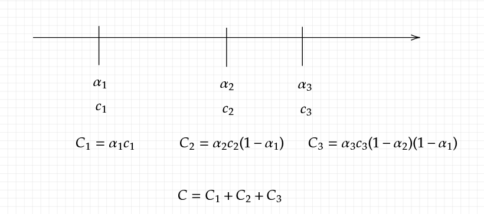
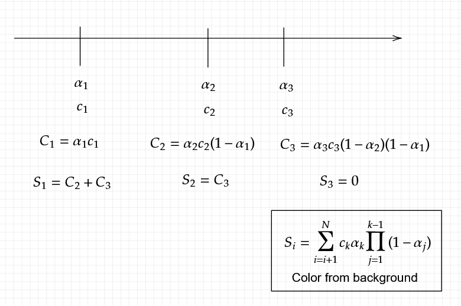

## 2d gaussian splatting for 2d image reconstruction  

<!--  -->

## build

```
git submodule update --init
premake5 vs2022
```

## references
- 3D Gaussian Splatting for Real-Time Radiance Field Rendering
- (Ja) https://www.youtube.com/watch?v=VyVi7iPb1Uw
- (En) https://www.youtube.com/watch?v=e50Bj7jn9IQ


## Formulation
It doesn't use any of auto-diff tools, here is the analytical form of several derivatives.

### 2d splat 

```
struct Splat
{
    glm::vec2 pos; 
	float sx;
	float sy;
	float rot;
    glm::vec3 color;
	float opacity;
};
```

### The covariance matrix 

$$
\begin{aligned}
\Sigma =VLV^{2} & =\begin{bmatrix}
\cos \theta  & \sin \theta \\
-\sin \theta  & \cos \theta 
\end{bmatrix}\begin{bmatrix}
s_{x}^{2} & 0\\
0 & s_{y}^{2}
\end{bmatrix}\begin{bmatrix}
\cos \theta  & -\sin \theta \\
\sin \theta  & \cos \theta 
\end{bmatrix}
\end{aligned}
$$


### Inverse of the covariance matrix 
$$
\Sigma ^{-1} =\begin{bmatrix}
a & b\\
c & d
\end{bmatrix} =\begin{bmatrix}
s_{y}^{-2}\sin^{2} \theta +s_{x}^{-2}\cos^{2} \theta  & s_{x}^{-2}\sin \theta \cos \theta -s_{y}^{-2}\sin \theta \cos \theta \\
s_{x}^{-2}\sin \theta \cos \theta -s_{y}^{-2}\sin \theta \cos \theta  & s_{y}^{-2}\cos^{2} \theta +s_{x}^{-2}\sin^{2} \theta 
\end{bmatrix}
$$

### alpha

$$
\begin{aligned}
\alpha _{i}( x) & = o_{i}\exp\left( -\frac{1}{2}( x-\mu )^{T} \Sigma ^{-1}( x-\mu )\right)\\
 & = o_{i}\exp\left( -\frac{1}{2}\vec{v}^{T} \Sigma ^{-1}\vec{v}\right)
\end{aligned}
$$

### Pixel Color

$$
C=\sum _{i\in N} c_{i} \alpha _{i}\prod _{j=1}^{i-1}( 1-\alpha _{j})
$$

Note that this is 2d so order is pre-defined. Also, there is no reorder, cloning etc.



### Derivative of color

$$
\frac{\partial C_{r,g,b}}{\partial c_{i}} =\sum _{i\in N} \alpha _{i}\prod _{j=1}^{i-1}( 1-\alpha _{j})
$$

### Derivative of alpha

Let's use an idea of color from the back $S_i$:



$$
\begin{aligned}
\frac{\partial C}{\partial \alpha _{i}} & =\frac{\partial C_{i}}{\partial \alpha _{i}} +\frac{\partial S_{i}}{\partial \alpha _{i}}\\
 & =c_{i}\prod _{j=1}^{i-1}( 1-\alpha _{j}) -\frac{S_{i}}{( 1-\alpha _{i})}
\end{aligned}
$$

Note that $\frac{S_{i}}{( 1-\alpha _{i})}$ is a constant.

### Derivatives of position

$$
\begin{aligned}
\frac{\partial \alpha _{i}}{\partial \vec{v}_{x}} & =\frac{\partial }{\partial \vec{v}_{x}} o_{i}\exp\left( -\frac{1}{2}\vec{v}^{T} \Sigma ^{-1}\vec{v}\right)\\
 & =\alpha _{i}\frac{\partial }{\partial \vec{v}_{x}}\left( -\frac{1}{2}\vec{v}^{T} \Sigma ^{-1}\vec{v}\right)\\
 & =-\frac{1}{2} \alpha _{i}\frac{\partial }{\partial \vec{v}_{x}}\left(\vec{v}^{T} \Sigma ^{-1}\vec{v}\right)\\
 & =-\frac{1}{2} \alpha _{i}\frac{\partial }{\partial \vec{v}_{x}}\left(\vec{v}^{T}\begin{bmatrix}
a & b\\
c & d
\end{bmatrix}\vec{v}\right)\\
 & =-\frac{1}{2} \alpha _{i}\frac{\partial }{\partial p_{x}}\left(\begin{bmatrix}
\vec{v}_{x} & \vec{v}_{y}
\end{bmatrix}\begin{bmatrix}
a\vec{v}_{x} +b\vec{v}_{y}\\
c\vec{v}_{x} +d\vec{v}_{y}
\end{bmatrix}\right)\\
 & =-\frac{1}{2} \alpha _{i}\frac{\partial }{\partial p_{x}}\left( a\vec{v}_{x}^{2} +b\vec{v}_{x}\vec{v}_{y} +c\vec{v}_{x}\vec{v}_{y} +d\vec{v}_{y}^{2}\right)\\
 & =-\frac{1}{2} \alpha _{i}\frac{\partial }{\partial p_{x}}\left( a\vec{v}_{x}^{2} +( b+c)\vec{v}_{x}\vec{v}_{y} +d\vec{v}_{y}^{2}\right)\\
 & =-\frac{1}{2} \alpha _{i}( 2a\vec{v}_{x} +( b+c)\vec{v}_{y})\\
 & \\
\frac{\partial \alpha _{i}}{\partial \vec{v}_{y}} & =-\frac{1}{2} \alpha _{i}\frac{\partial }{\partial p_{y}}\left( a\vec{v}_{x}^{2} +( b+c)\vec{v}_{x}\vec{v}_{y} +d\vec{v}_{y}^{2}\right)\\
 & =-\frac{1}{2} \alpha _{i}( 2d\vec{v}_{y} +( b+c)\vec{v}_{x})
\end{aligned}
$$

Thus, derivatives for the position of gaussian are: 

$$
\begin{aligned}
\frac{\partial \alpha _{i}}{\partial \vec{\mu }_{x}} & =-\frac{\partial \alpha _{i}}{\partial \vec{v}_{x}} =\frac{1}{2} \alpha _{i}( 2a\vec{v}_{x} +( b+c)\vec{v}_{y})\\
\frac{\partial \alpha _{i}}{\partial \vec{\mu }_{x}} & =-\frac{\partial \alpha _{i}}{\partial \vec{v}_{y}} =\frac{1}{2} \alpha _{i}( 2d\vec{v}_{y} +( b+c)\vec{v}_{x})
\end{aligned}
$$

### Derivatives of scaling x,y
$$
\begin{aligned}
\frac{\partial \alpha _{i}}{\partial s_{x}} & =\frac{\partial }{\partial \vec{s}_{x}} o_{i}\exp\left( -\frac{1}{2}\vec{v}^{T} \Sigma ^{-1}\vec{v}\right)\\
 & =\alpha _{i}\frac{\partial }{\partial s_{x}}\left( -\frac{1}{2}\vec{v}^{T} \Sigma ^{-1}\vec{v}\right)\\
 & =-\frac{1}{2} \alpha _{i}\frac{\partial }{\partial s_{x}}\left(\vec{v}^{T} \Sigma ^{-1}\vec{v}\right)\\
 & =-\frac{1}{2} \alpha _{i}\frac{\partial }{\partial s_{x}}\left(\vec{v}^{T}\begin{bmatrix}
a & b\\
c & d
\end{bmatrix}\vec{v}\right)
\end{aligned}
$$

Need derivatives for each compornents in $\Sigma^{-1}$: 

$$
 \begin{array}{l}
\begin{aligned}
\frac{\partial a}{\partial s_{x}} & =-2s_{x}^{-3}\cos^{2} \theta \\
\frac{\partial a}{\partial \overrightarrow{s_{y}}} & =-2s_{y}^{-3}\sin^{2} \theta 
\end{aligned}\\
\begin{aligned}
\frac{\partial b}{\partial s_{x}} =\frac{\partial c}{\partial s_{x}} & =-2s_{x}^{-3}\sin \theta \cos \theta \\
\frac{\partial b}{\partial s_{y}} =\frac{\partial c}{\partial s_{y}} & =2s_{y}^{-3}\sin \theta \cos \theta 
\end{aligned}\\
\begin{aligned}
\frac{\partial d}{\partial s_{x}} & =-2s_{x}^{-3}\sin^{2} \theta \\
\frac{\partial d}{\partial s_{y}} & =-2s_{y}^{-3}\sin^{2} \theta 
\end{aligned}
\end{array}
$$

Thus, combining aboves: 

$$
\begin{aligned}
\frac{\partial \alpha _{i}}{\partial s_{x}} & =-\frac{1}{2} \alpha _{i}\frac{\partial }{\partial s_{x}}\left( a\vec{v}_{x}^{2} +b\vec{v}_{x}\vec{v}_{y} +c\vec{v}_{x}\vec{v}_{y} +d\vec{v}_{y}^{2}\right)\\
 & =-\frac{1}{2} \alpha _{i}\left\{\frac{\partial }{\partial s_{x}} a\vec{v}_{x}^{2} +\frac{\partial }{\partial s_{x}} b\vec{v}_{x}\vec{v}_{y} +\frac{\partial }{\partial s_{x}} c\vec{v}_{x}\vec{v}_{y} +\frac{\partial }{\partial s_{x}} d\vec{v}_{y}^{2}\right)\\
 & =-\frac{1}{2} \alpha _{i}\left\{\left( -2s_{x}^{-3}\cos^{2} \theta \right)\vec{v}_{x}^{2} +2\left( -2s_{x}^{-3}\sin \theta \cos \theta \right)\vec{v}_{x}\vec{v}_{y} +\left( -2s_{x}^{-3}\sin^{2} \theta \right)\vec{v}_{y}^{2}\right)\\
 & =-\alpha _{i}\left\{\left( -s_{x}^{-3}\cos^{2} \theta \right)\vec{v}_{x}^{2} +\left( -2s_{x}^{-3}\sin \theta \cos \theta \right)\vec{v}_{x}\vec{v}_{y} +\left( -s_{x}^{-3}\sin^{2} \theta \right)\vec{v}_{y}^{2}\right)\\
 & =\alpha _{i}\left\{\left( s_{x}^{-3}\cos^{2} \theta \right)\vec{v}_{x}^{2} +\left( 2s_{x}^{-3}\sin \theta \cos \theta \right)\vec{v}_{x}\vec{v}_{y} +\left( s_{x}^{-3}\sin^{2} \theta \right)\vec{v}_{y}^{2}\right)\\
 & =\alpha _{i}\frac{1}{s_{x}^{3}}\left\{\cos^{2} \theta \vec{v}_{x}^{2} +2\sin \theta \cos \theta \vec{v}_{x}\vec{v}_{y} +\sin^{2} \theta \vec{v}_{y}^{2}\right)\\
 & =\frac{\alpha _{i}}{s_{x}^{3}}\begin{bmatrix}
\cos^{2} \theta \\
2\sin \theta \cos \theta \\
\sin^{2} \theta 
\end{bmatrix}^{T}\begin{bmatrix}
\vec{v}_{x}^{2}\\
\vec{v}_{x}\vec{v}_{y}\\
\vec{v}_{y}^{2}
\end{bmatrix}\\
 & \\
\frac{\partial \alpha _{i}}{\partial s_{y}} & =-\frac{1}{2} \alpha _{i}\left\{\frac{\partial }{\partial s_{y}} a\vec{v}_{x}^{2} +\frac{\partial }{\partial s_{y}} b\vec{v}_{x}\vec{v}_{y} +\frac{\partial }{\partial s_{y}} c\vec{v}_{x}\vec{v}_{y} +\frac{\partial }{\partial s_{y}} d\vec{v}_{y}^{2}\right)\\
 & =-\frac{1}{2} \alpha _{i}\left\{\left( -2s_{y}^{-3}\sin^{2} \theta \right)\vec{v}_{x}^{2} +2\left( 2s_{y}^{-3}\sin \theta \cos \theta \right)\vec{v}_{x}\vec{v}_{y} +\left( -2s_{y}^{-3}\sin^{2} \theta \right)\vec{v}_{y}^{2}\right)\\
 & =\frac{\alpha _{i}}{s_{y}^{3}}\left\{\sin^{2} \theta \vec{v}_{x}^{2} -2\sin \theta \cos \theta \vec{v}_{x}\vec{v}_{y} +\sin^{2} \theta \vec{v}_{y}^{2}\right)\\
 & =\frac{\alpha _{i}}{s_{y}^{3}}\begin{bmatrix}
\sin^{2} \theta \\
-2\sin \theta \cos \theta \\
\cos^{2} \theta 
\end{bmatrix}^{T}\begin{bmatrix}
\vec{v}_{x}^{2}\\
\vec{v}_{x}\vec{v}_{y}\\
\vec{v}_{y}^{2}
\end{bmatrix}
\end{aligned}

$$

### Derivatives of rotation

Starts from derivatives of each compornent in $\Sigma^{-1}$:

$$

 \begin{array}{l}
\begin{aligned}
\frac{\partial a}{\partial \theta } & =2\left( s_{y}^{-2} -s_{x}^{-2}\right)\sin \theta \cos \theta \\
 & =2\left(\frac{s_{x}^{2} -s_{y}^{2}}{s_{x}^{2} s_{y}^{2}}\right)\sin \theta \cos \theta 
\end{aligned}\\
\frac{\partial b}{\partial \theta } =\frac{\partial c}{\partial \theta } =-\left(\frac{s_{x}^{2} -s_{y}^{2}}{s_{x}^{2} s_{y}^{2}}\right)\left(\cos^{2} \theta -\sin^{2} \theta \right)\\
\\
\frac{\partial d}{\partial \theta } =-2\left( s_{y}^{-2} -s_{x}^{-2}\right)\sin \theta \cos \theta =-\frac{\partial a}{\partial \theta }
\end{array}

$$

Combining the aboves:

$$
\begin{aligned}
\frac{\partial \alpha _{i}}{\partial \theta } & =\frac{\partial }{\partial \theta } o_{i}\exp\left( -\frac{1}{2}( x-\mu )^{T} \Sigma ^{-1}( x-\mu )\right)\\
 & = -\frac{1}{2} \alpha _{i}\frac{\partial }{\partial \theta }\left(\vec{v}^{T}\begin{bmatrix}
a & b\\
c & d
\end{bmatrix}\vec{v}\right)\\
 & = -\frac{1}{2} \alpha _{i}\left(\frac{\partial a}{\partial \theta }\vec{v}_{x}^{2} +\frac{\partial b}{\partial \theta }\vec{v}_{x}\vec{v}_{y} +\frac{\partial c}{\partial \theta }\vec{v}_{x}\vec{v}_{y} +\frac{\partial d}{\partial \theta }\vec{v}_{y}^{2}\right)\\
 & = -\frac{1}{2} \alpha _{i}\left(\frac{\partial a}{\partial \theta }\vec{v}_{x}^{2} +2\frac{\partial b}{\partial \theta }\vec{v}_{x}\vec{v}_{y} +\frac{\partial d}{\partial \theta }\vec{v}_{y}^{2}\right)\\
 & = -\frac{1}{2} \alpha _{i}\left(\frac{\partial a}{\partial \theta }\vec{v}_{x}^{2} +2\frac{\partial b}{\partial \theta }\vec{v}_{x}\vec{v}_{y} -\frac{\partial a}{\partial \theta }\vec{v}_{y}^{2}\right)\\
 & = -\frac{1}{2} \alpha _{i}\left(\frac{\partial a}{\partial \theta }\left(\vec{v}_{x}^{2} -\vec{v}_{y}^{2}\right) +2\frac{\partial b}{\partial \theta }\vec{v}_{x}\vec{v}_{y}\right)\\
 & = -\frac{1}{2} \alpha _{i}\left( 2\left(\frac{s_{x}^{2} -s_{y}^{2}}{s_{x}^{2} s_{y}^{2}}\right)\sin \theta \cos \theta \left(\vec{v}_{x}^{2} -\vec{v}_{y}^{2}\right) +2\left( -\left(\frac{s_{x}^{2} -s_{y}^{2}}{s_{x}^{2} s_{y}^{2}}\right)\left(\cos^{2} \theta -\sin^{2} \theta \right)\right)\vec{v}_{x}\vec{v}_{y}\right)\\
 & = - \alpha _{i}\left(\frac{s_{x}^{2} -s_{y}^{2}}{s_{x}^{2} s_{y}^{2}}\right)\left(\sin \theta \cos \theta \left(\vec{v}_{x}^{2} -\vec{v}_{y}^{2}\right) -\left(\cos^{2} \theta -\sin^{2} \theta \right)\vec{v}_{x}\vec{v}_{y}\right)\\
 & =\alpha _{i}\left(\frac{s_{x}^{2} -s_{y}^{2}}{s_{x}^{2} s_{y}^{2}}\right)\left(\left(\cos^{2} \theta -\sin^{2} \theta \right)\vec{v}_{x}\vec{v}_{y} -\sin \theta \cos \theta \left(\vec{v}_{x}^{2} -\vec{v}_{y}^{2}\right)\right)
\end{aligned}
$$


### Derivaties of opacity
$$
\begin{aligned}
\frac{\partial \alpha _{i}}{\partial o_{i}} & =\frac{\partial \alpha _{i}}{\partial o_{i}} o_{i}\exp\left( -\frac{1}{2}\vec{v}^{T} \Sigma ^{-1}\vec{v}\right)\\
 & =\exp\left( -\frac{1}{2}\vec{v}^{T} \Sigma ^{-1}\vec{v}\right)
\end{aligned}
$$